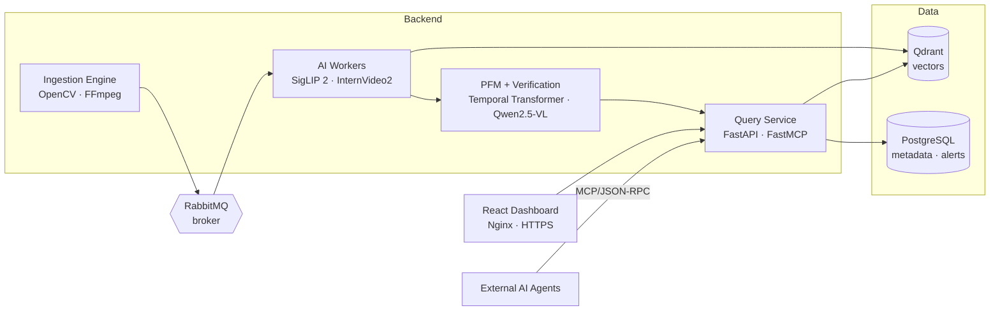
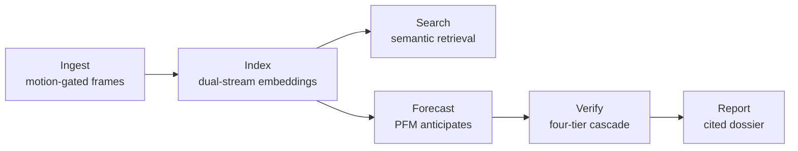

<div align="center">

# 🛰️ OmniSight

### Distributed Semantic Video Intelligence & Predictive Reasoning Platform

*Search video by meaning, anticipate events before they happen, and generate evidence-grounded incident reports — in one end-to-end pipeline.*


</div>

---

## Overview

Video is one of the most abundant data sources in the world — surveillance networks, sports broadcasts, and traffic cameras record around the clock. Yet this footage is far easier to collect than to use. Finding a single moment in it can take hours of manual review, and spotting an event *as it unfolds* is harder still.

**OmniSight** closes that gap. It ingests live and recorded video, indexes it by *meaning* rather than by file or timestamp, and lets users search in everyday language. Beyond retrieving what has already happened, a **Predictive Forecasting Module** recognizes the early signs of an unfolding event and raises a warning before it completes, a layered verification cascade filters out false alarms, and a retrieval-augmented module assembles multi-camera footage into fully cited incident reports. Every capability is available through a web dashboard **and** to external AI agents via the Model Context Protocol (MCP).

---

## The Problem

In current practice, video-analytics systems share four limitations:

- **Fixed vocabulary** — footage is indexed by predefined object and event categories, so retrieval depends on having anticipated in advance what someone would later need to find.
- **Retrospective only** — incidents are examined *after* they occur rather than flagged as they develop.
- **Single-domain** — each deployment is tuned to one environment and re-engineered for the next.
- **Manual reconstruction** — assembling an incident across several cameras is a hand-built task for a human analyst.

The core problem is that searching and analyzing long-form video *by what actually happens in it* is still too slow and too fragmented to support decisions while they still matter.

---

## Key Capabilities

| | Capability | What it does |
|---|---|---|
| 🔍 | **Semantic Search** | Open-vocabulary natural-language search over surveillance, sports, and traffic archives. |
| 🔮 | **Predictive Forecasting (PFM)** | A single temporal model, shared across all three domains, predicts event type, time-to-event, and confidence — with measurable early-warning lead time. |
| 🛡️ | **Agentic Verification** | A four-tier cascade filters candidate alerts from a cheap similarity check up to VLM causal reasoning, keeping only credible alerts. |
| 📑 | **Forensic Synthesis (RAG)** | Assembles multi-camera evidence into a structured, fully cited incident report where every claim is grounded. |
| 🤖 | **Agent-Native Access (MCP)** | External AI agents call the same capabilities through a standard protocol — no custom integration code. |

> **The central contribution** is the PFM: one temporal backbone shared across surveillance, sports, and traffic, whose ability to *transfer across domains* is measured directly rather than assumed.

---

## System Architecture

Containerized microservices, decoupled by a message broker, orchestrated with Docker Compose.



---

## How It Works



A frame is first checked for motion; still frames are discarded. Active frames are encoded twice in parallel — once for scene content (SigLIP 2), once for short-term motion (InternVideo2) — and stored so footage becomes searchable. The system then forecasts whether an incident is imminent; low-confidence cases stop quietly, while high-confidence ones raise an alert that passes through a verification cascade before reaching the operator. Only a confirmed alert triggers the final step: assembling a cited forensic dossier.

---

## Core Algorithms

1. **ROI-Aware Spatial-Motion Sampling** — forwards only frames with meaningful motion.
2. **Dual-Stream Embedding Generation** — captures both scene and temporal content.
3. **Dual-Model Score Fusion** — reciprocal rank fusion across the frame and clip indexes.
4. **Predictive Forecasting Module** — shared temporal backbone with per-domain heads, plus a cross-domain transfer protocol.
5. **Four-Tier Agentic Verification** — cheapest-to-most-expensive alert filtering.
6. **Multimodal RAG Forensic Synthesis** — scoped retrieval, cross-camera correlation, cited report generation.

---

## Tech Stack

| Layer | Technologies |
|---|---|
| **Ingestion** | OpenCV · FFmpeg |
| **Vision / Video Models** | SigLIP 2 · InternVideo2 · Qwen2.5-VL |
| **ML Framework** | PyTorch · Hugging Face Transformers |
| **Vector Search** | Qdrant (HNSW ANN) |
| **Relational Store** | PostgreSQL |
| **Messaging** | RabbitMQ |
| **API** | FastAPI (REST) · FastMCP (MCP) |
| **Frontend** | React · Nginx |
| **Orchestration** | Docker · Docker Compose |

---

## Datasets

Evaluated across three domains, chosen to differ in viewpoint, event type, and visual regime so cross-domain transfer is measured on genuinely distinct data.

| Dataset | Domain | Role |
|---|---|---|
| **VIRAT** | Surveillance | Ingestion & semantic-search evaluation |
| **UCF-Crime** | Surveillance | Forecasting head · verification · false-positive evaluation |
| **SoccerNet** | Sports | Sports head · cross-domain transfer |
| **DoTA** | Traffic | Time-to-event & early-warning measurement |
| **AI City Challenge** | Traffic | Multi-camera forensic-dossier validation |

---

## Repository Structure

```
omni-sight/
├── README.md
├── Phase-A/          # Project book (PDF) and final presentation
├── demo/             # Prototype / proof-of-concept
└── phase-b/          # Full platform implementation
```

📖 **Documentation:** the complete [project book](./Phase-A) covers the literature review, requirements, system design, algorithms, evaluation metrics, and test plan in detail.

---

## Getting Started

> Requires Docker and Docker Compose.

```bash
git clone https://github.com/OmniSight-team/omni-sight.git
cd omni-sight
docker compose up --build
```

The dashboard is served over HTTPS via Nginx; external agents connect to the Query Service over MCP.

---

## Success Metrics

The platform is evaluated against measurable acceptance criteria, including:

- **Search quality** — correct clip in the top 5 for ≥ 85% of natural-language queries.
- **Prediction accuracy** — true event in the top 3 for ≥ 70%, per domain.
- **Early-warning time** — warnings fire ≥ 15 s before the event begins.
- **False-alarm rate** — ≤ 20% of warnings false, per domain.
- **Cross-domain learning** — ≥ 10% accuracy lift from multi-domain pre-training.
- **Forensic reporting** — coherent, cited reports for multi-camera scenarios.

---

## Team

**Ahmad Tawil** · **Cyrine Fahoum**
Advisor: **Dr. Reuven Cohen**
Software Engineering Department — Braude College of Engineering
Project Code: `26-2-D-17`

---

<div align="center">
<sub>Built with an emphasis on measurable, evidence-grounded video intelligence.</sub>
</div>
